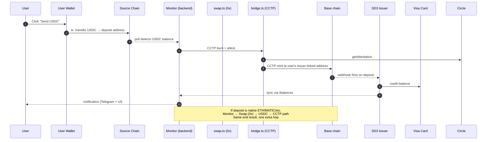
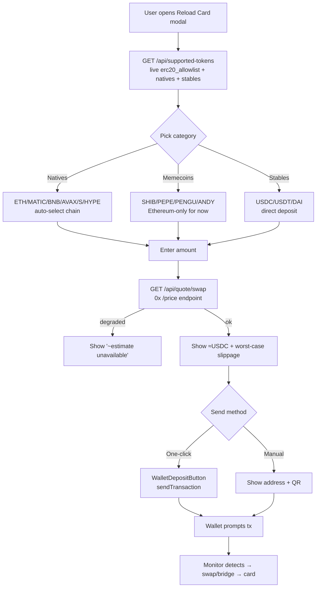
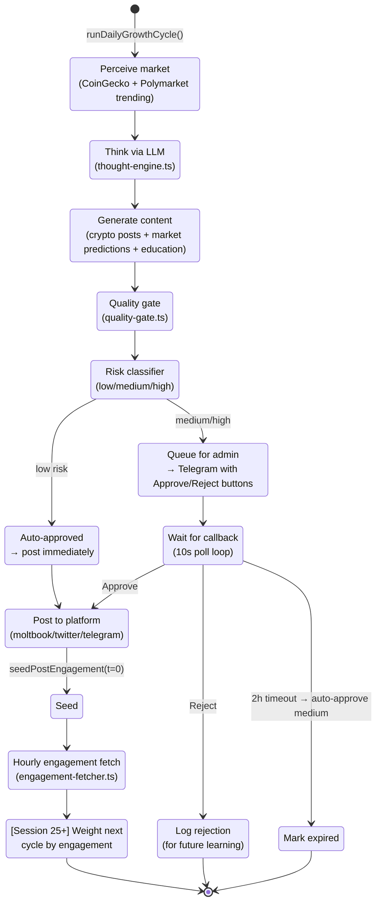
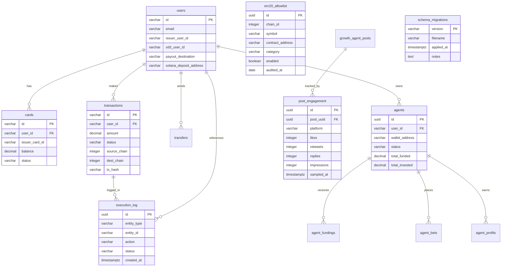
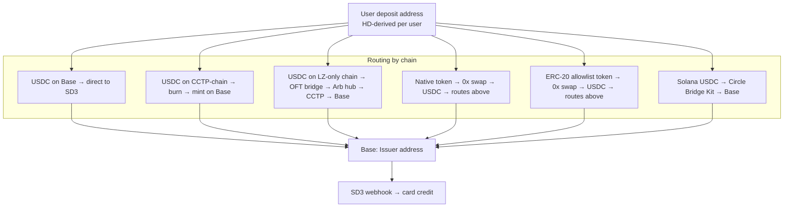
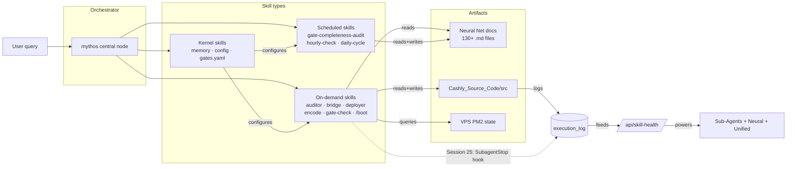
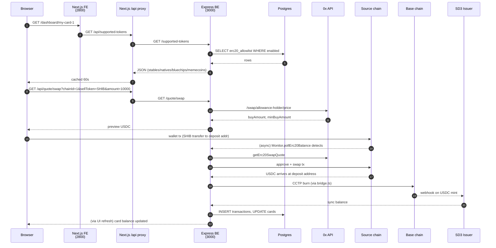
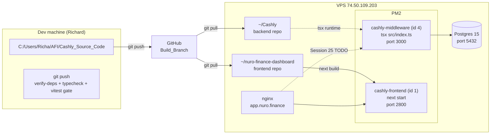

# AFI System Architecture

> Canonical map of how AFI's pieces talk to each other. Updated as of Session 25 (2026-04-19).
> Source of truth for: `Cashly_Source_Code/` layout, VPS runtime, external integrations, on-chain infra.
> Rendered visually at [`app.nuro.finance/architecture.html`](https://app.nuro.finance/architecture.html).

**Core principle**: Intent Layer records intent. Execution Layer moves real money. Never conflate.

---

## 1. System-wide flow (the 30,000-ft view)

```mermaid
flowchart LR
    subgraph Client["🖥️ Client — Browser"]
        UI[Next.js 15.5.14 FE<br/>app.nuro.finance]
        Wallet[Wagmi / Privy<br/>wallet connector]
    end

    subgraph Auth["🔐 Auth Layer"]
        NAuth[NextAuth v5<br/>JWT sessions]
    end

    subgraph Proxy["⚡ Next.js Edge — port 2800"]
        NR["/api/* route handlers<br/>(proxy to backend)"]
        Static["/public/* static HTML<br/>(dashboards)"]
    end

    subgraph Backend["⚙️ Express Backend — port 3000"]
        NuroR[nuro-routes.ts<br/>REST API]
        AdminC[admin-console.ts<br/>ops dashboard]
        Monitor[monitor.ts<br/>pollChain + pollNative<br/>+ pollErc20 + pollSolana]
        Exec[execution-dispatch.ts<br/>sweeps queue]
        Swap[swap.ts<br/>0x allowance-holder]
        Bridge[bridge.ts<br/>CCTP + LZ]
        Mythos[growth-agent/*<br/>thought-engine + approval]
    end

    subgraph DB["💾 Postgres — port 5432"]
        Users[(users · cards<br/>transactions · transfers)]
        Agent[(agents · agent_fundings<br/>agent_bets · agent_profits)]
        AllowL[(erc20_allowlist)]
        ExecLog[(execution_log)]
        Growth[(growth_agent_memory<br/>growth_agent_posts<br/>post_engagement)]
    end

    subgraph External["🌐 External Services"]
        Zerox[0x Aggregator v2]
        Circle[Circle CCTP]
        LZ[LayerZero V2]
        SD3[SD3 Issuer<br/>Visa card network]
        TG[Telegram]
        MB[Moltbook]
        TW[Twitter v2]
        HG[HeyGen]
    end

    subgraph Chain["⛓️ On-Chain — 23 chains"]
        EVM[EVM 22 chains<br/>ETH · Base · Arb · etc.]
        Sol[Solana]
    end

    UI --> NAuth
    UI --> NR
    UI --> Static
    Wallet --> EVM

    NR --> NuroR
    NuroR --> DB
    NuroR --> Swap
    NuroR --> Bridge
    AdminC --> ExecLog
    AdminC --> AllowL

    Monitor --> EVM
    Monitor --> Sol
    Monitor --> Exec
    Exec --> Bridge
    Exec --> DB

    Swap --> Zerox
    Swap --> EVM
    Bridge --> Circle
    Bridge --> LZ
    Bridge --> EVM
    Bridge --> Sol

    Mythos --> TG
    Mythos --> MB
    Mythos --> TW
    Mythos --> HG
    Mythos --> Growth

    NuroR --> SD3
    Exec --> SD3

    style Client fill:#1a1a2e,stroke:#16e0a9
    style Backend fill:#1a1a2e,stroke:#c770f0
    style DB fill:#1a1a2e,stroke:#5b8def
    style External fill:#1a1a2e,stroke:#f5a623
    style Chain fill:#1a1a2e,stroke:#ff6b6b
```



---

## 2. Critical path: User deposit → Card credit

The canonical money-movement flow. Everything else is a variant.



**Variants**:
- **Native token path**: Monitor detects ETH/MATIC/BNB/AVAX/S/HYPE → `swap.ts::executeNativeToUsdcSwap` → USDC lands at same address → pollChain picks it up → CCTP bridge. (Session 23 Marathon 7)
- **ERC-20 path**: Monitor detects LINK/UNI/WBTC/WETH/cbBTC or memecoin (SHIB/PEPE/PENGU/ANDY) → `executeErc20ToUsdcSwap` (approve + swap) → same terminus.
- **Base-direct path**: USDC already on Base → skip CCTP, send directly to Issuer address.
- **Solana path**: Solana CCTP via `@circle-fin/bridge-kit` → Base mint → Issuer.

---

## 3. Reload Card UI → Backend flow



---

## 4. Mythos daily cycle



---

## 5. Database schema (key relations)



---

## 6. External service topology

```mermaid
flowchart LR
    Backend[AFI Backend]

    subgraph MoneyRouting["💰 Money movement"]
        Zerox[0x Aggregator v2<br/>native + ERC-20 swaps]
        Circle[Circle CCTP<br/>USDC burn+mint]
        LZ[LayerZero V2<br/>OFT cross-chain]
        SD3["SD3 Issuer<br/>(Owen)<br/>Visa card + KYC"]
    end

    subgraph Content["📣 Content + Growth"]
        TG[Telegram Bot API<br/>admin approvals]
        MB[Moltbook API<br/>primary platform]
        TW[Twitter v2 API<br/>OAuth1 post + Bearer read]
        HG[HeyGen API<br/>avatar video]
    end

    subgraph AI["🧠 AI / ML"]
        Anth[Anthropic Claude<br/>(thought-engine)]
        CG[CoinGecko<br/>market data]
        PM[Polymarket CLOB<br/>agent trades]
    end

    Backend --> Zerox
    Backend --> Circle
    Backend --> LZ
    Backend --> SD3
    Backend --> TG
    Backend --> MB
    Backend --> TW
    Backend --> HG
    Backend --> Anth
    Backend --> CG
    Backend --> PM

    style MoneyRouting fill:#1a1a2e,stroke:#16e0a9
    style Content fill:#1a1a2e,stroke:#c770f0
    style AI fill:#1a1a2e,stroke:#5b8def
```

---

## 7. On-chain infrastructure

**13 chains support native swap** (Marathon 7): Ethereum, Base, Arbitrum, Optimism, Polygon, BSC, Avalanche, Linea, Scroll, Unichain, World Chain, Sonic, HyperEVM.

**23 chains support stable deposits** (CCTP or LZ bridge): the 13 above + zkSync, Celo, Gnosis, Sei, XDC, Codex, Ink, Plume, Monad, Solana.



---

## 8. Neural Net (my own brain)

Two dashboards at `app.nuro.finance/*`:
- **`/sub-agents-dashboard.html`** — orchestration topology (119 nodes, 131 links). Live health + invocation heat.
- **`/neural-dashboard.html`** — decision playback. File-access traces over time.
- **`/unified-dashboard.html`** *(Session 25 target)* — overlays both.



---

## 9. Request lifecycle (canonical — Reload Card)



---

## 10. Deployment topology



---

## References

- `Neural Net/Claude Memory/INDEX.md` — master context
- `Neural Net/Claude Memory/tech_decisions_afi.md` (synced to `~/.claude/projects/.../memory/`) — canonical tech patterns
- `Neural Net/Claude Memory/Swap Risk Policy.md` — user eats volatility
- `Neural Net/Claude Memory/Memecoin Allowlist Policy.md` — 5-criteria audit
- `Cashly_Source_Code/docs/Claude Memory/SD3 Card API/` — Issuer integration docs
- `Cashly_Source_Code/src/migrations/` — schema evolution (25 migrations applied)
